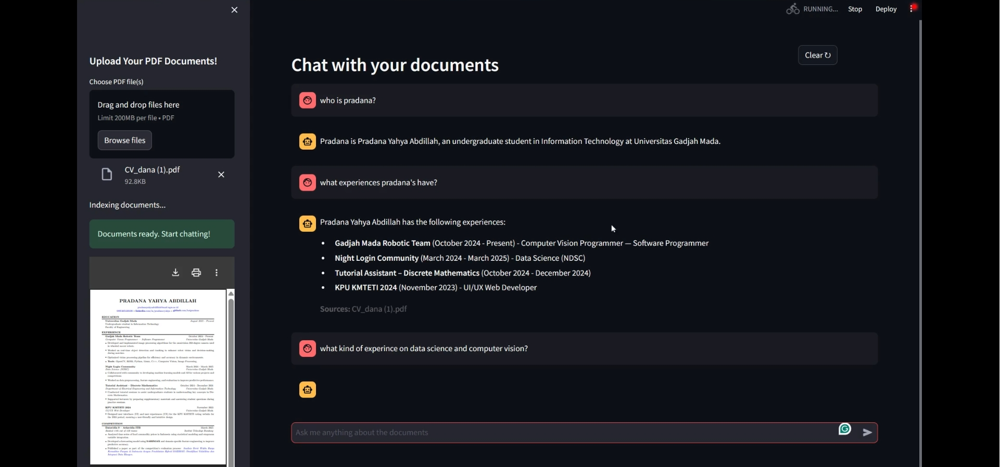

# ChatMyDocs

RAG-based PDF chat assistant with advanced retrieval and reranking capabilities.

## Features

• **ModernBERT Embeddings**: Uses `nomic-ai/modernbert-embed-base` for semantic search

• **Smart Reranking**: Cross-encoder reranking with `cross-encoder/ms-marco-MiniLM-L-6-v2`

• **OCR Support**: Automatic text extraction with EasyOCR fallback

• **Streaming Responses**: Real-time chat with Gemini 2.5-flash

• **Source Citations**: Shows document sources for each answer

## Demo

[](https://youtu.be/lETbVuimVCg)

## Quick Setup

1. **Install dependencies**:
   ```bash
   pip install -r requirements.txt
   ```

2. **Configure API**:
   Create `.env` file and add your Gemini API key:
   ```
   GEMINI_API_KEY=your_gemini_api_key_here
   ```

3. **Run the app**:
   ```bash
   streamlit run app.py
   ```


## Stack

• **Frontend**: Streamlit

• **Embeddings**: ModernBERT (`nomic-ai/modernbert-embed-base`)

• **Reranking**: Cross-encoder (`cross-encoder/ms-marco-MiniLM-L-6-v2`)

• **LLM**: Google Gemini 2.5-flash

• **PDF Processing**: PyPDF2 + EasyOCR (for pdf with image, not scanned)

• **Vector Store**: LlamaIndex VectorStoreIndex
